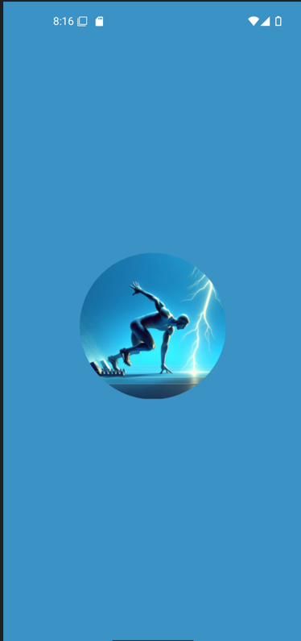
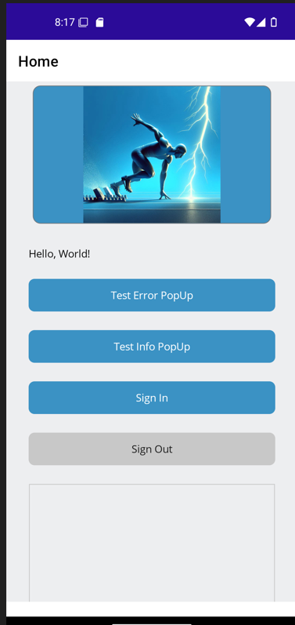
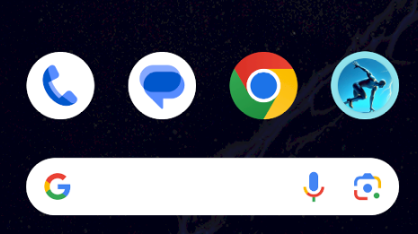
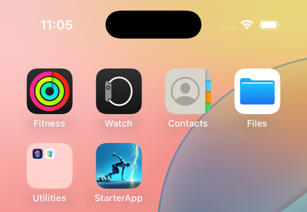
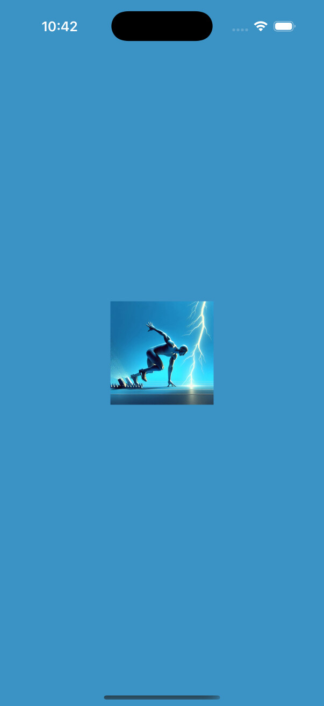
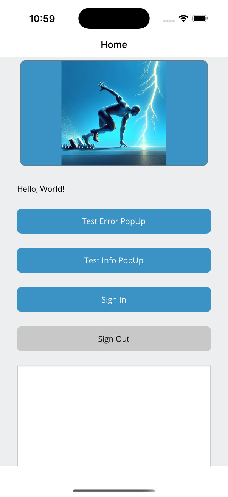
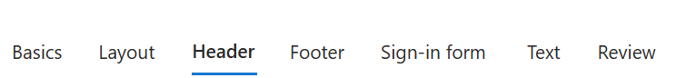
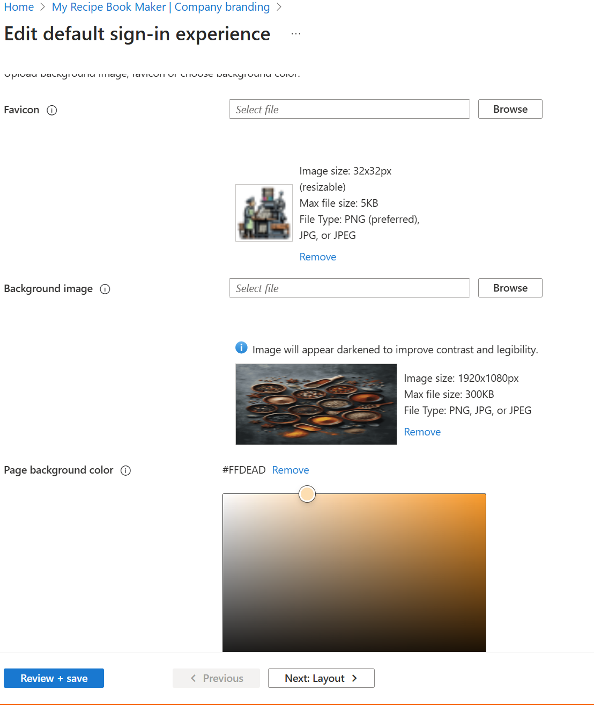
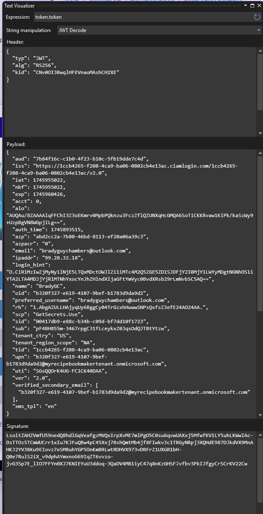

# .NET MAUI Starter App with Authorization

<!--TOC-->
- [01 - Starter App - Authentication](#01-starter-app-authentication)
  - [a) First Things first](#a-first-things-first)
  - [b) Standard Error Handling](#b-standard-error-handling)
    - [Third Party Controls](#third-party-controls)
      - [[DevExpress](https://www.devexpress.com/maui/)](#devexpresshttpswww.devexpress.commaui)
      - [[Syncfusion](https://www.syncfusion.com/maui-controls)](#syncfusionhttpswww.syncfusion.commaui-controls)
  - [c) Microsoft Azure AD B2C and Customer (EntraID) Authentication](#c-microsoft-azure-ad-b2c-and-customer-entraid-authentication)
    - [Configure Entra External ID and App Registration](#configure-entra-external-id-and-app-registration)
    - [Custom Branding](#custom-branding)
  - [d) Updating the application Code](#d-updating-the-application-code)
    - [Nuget Package Updates](#nuget-package-updates)
    - [Automating ClientID](#automating-clientid)
<!--/TOC-->

# 01 - Starter App - Authentication 
This app demonstrates how to use the Microsoft.Identity.Client library to authenticate users and access Microsoft Graph APIs in a .NET MAUI app.  It is based off of the example from [.NET MAUI Authentication](https://github.com/Azure-Samples/ms-identity-ciam-dotnet-tutorial/blob/main/1-Authentication/2-sign-in-maui/README.md)

The intenet of this repo is to create a base MAUI that can be a starting point for creating new applications with the core services already implemented or frameworked out as a good starting point.  

| Splash | Home Page |
|---------|---------|
| Android|
|| |
|Android | iOS|
|| |
| iOS||
| ||


## a) First Things first
Replace the app icon and splash screen with something that is reasonably decent to look at.  I am not sure what it is but the .NET icon and that blue splash screen just does not do it.

My method before going to a pro to get work done is to use designer.microsoft.com and generate an image that you can start with and update later when you are ready to go to market and can spend some time polishing.  But until then theres no need not to have something interesting.

Since this is a starter app I thought of a track runner coming off the blocks.  

Prompt: 
a runner starting out on the running blocks reaching out with one hand attempting to catch a lightning bolt blue background in a minimal 3d digital art style.

And setting the size to a square. Designer came up with what I thought was some pretty cool images.  


MAUI wants an svg file for the icon and splash image.  

**Photpea** is my image editor of choice lately.  It's as simple as opening the file and exporting to svg.  Then adding the svg file to the Resources\AppIcon and Resources\Splash folders in the project.  Double checking that the properties are set to MauiIcon and MauiSplash respectively.

I use powertoys to grab a color from the image randomly picking a color for the background.


		<!-- App Icon -->
		<MauiIcon Include="Resources\AppIcon\appicon.svg" />
		
		<!-- Splash Screen -->
		<MauiSplashScreen Include="Resources\Images\startappicon.svg">
		  <Color>#3b92c4</Color>
		  <BaseSize>128,128</BaseSize>
		</MauiSplashScreen>


## b) Standard Error Handling

I wrote a blog on this topic awhile back.  One of the first components needed in an app is the ability to tell the user something went wrong. I like to have this in place even before I start with authentication in that if authentication doesn't work you need to display an error message.  So it's one fo the first things I put in place.  The details of this can be found at the following link:

https://bradyguy.blog/dotnet-maui-standard-error-popup-pattern/

A quick recap:
In the folder CustomControls I put the class that defines the controls bindable properties.

In the Resources/Styles folder I added a file called ControlTemplates.xaml and added to the resource dictionary in the app.xaml file so that it's available throughout the entire app.

```XAML
    <ControlTemplate x:Key="ErrorPopupStandard" x:DataType="controls:ErrorPopupView">
        <popup:SfPopup
            x:Name="popupLayout"
            AcceptButtonText="OK"
            AppearanceMode="OneButton"
            BindingContext="{Binding Source={RelativeSource TemplatedParent}}"
            FooterHeight="40"
            HeaderHeight="80"
```

And you use the control in your page as follows:

```XAML
  <controls:ErrorPopupView
            Grid.Row="0"
            Grid.Column="0"
            ControlTemplate="{StaticResource ErrorPopupStandard}"
            ErrorCode="{Binding PopupDetails.ErrorCode}"
            ErrorMessage="{Binding PopupDetails.ErrorMessage}"
            ErrorReason="{Binding PopupDetails.ErrorReason}"
            HeightRequest="500"
            ShowErrorPopup="{Binding PopupDetails.IsOpen, Mode=TwoWay}"
            WidthRequest="300" />
```


### Third Party Controls


I use several third party controls that are free up to a certain extent.  You'll need to read the latest at devexpress and syncfusion license information. 
#### [DevExpress](https://www.devexpress.com/maui/)

 I like the theming capablities of devexpress.  The the theme manager can be used through out your app on all controls.  You can pick from several predefined theme colors or use hex color code as the base for the theme.  In the settings component I'll add the capability for the user to choose their own theme color.

 I have also found that I like the collectionview from devexpress over syncfusion and MAUI.  It's incredible easy to enable drag and drop.  And the Items filter capability is one of the most flexible I have seen.

#### [Syncfusion](https://www.syncfusion.com/maui-controls)

Syncfusion is the other provider of controls I use.  For some reason I could not get the devexpress popup control to work in a custom control.  It's most likely something I wasn't doing right but for expedancy I switched over to syncfusion and got the popup working in no time.  

The Rotator navigation control from syncfusion is really cool. 


## c) Microsoft Azure AD B2C and Customer (EntraID) Authentication

Starting with the example from 1-Authentication\2-sign-in-maui as an example from the offical example at  [.NET MAUI Authentication](https://github.com/Azure-Samples/ms-identity-ciam-dotnet-tutorial/blob/main/1-Authentication/2-sign-in-maui/README.md)

1. Configure Entra External Id
1. script to update appsettings.json
1. Updated packages


### Configure Entra External ID and App Registration
1. Create a tenant
1. Create App Registration
1. Add Platform and check msal...://auth
1. Add API Permissions
1. Grant admin consent for the API permissions
1. Configure User flows
1. Link Application to User Flow

The following video is a step by step walk through of how to set up the Azure AD B2C tenant and configure the app registration for your .NET MAUI app. It covers creating a new tenant, registering the application, setting up user flows, and configuring API permissions.

I'll call out something that may or may not be clear.

You configure the External ID in Entra that has the overall user flow and authorization process defined.  You can multiple applications that utilizes this process and they will all have the same login experience.  So you might have a web app, mobile app, and even some azure fundctions that utilize the login process.


[](https://www.youtube.com/watch?v=1j6J8Zk7Q9c)
  

### Custom Branding

The following article has the detailed instructions on how to implement your own custom branding for the login experience. 

https://learn.microsoft.com/en-us/entra/fundamentals/reference-company-branding-css-template

From the External ID 






```css
@font-face {
    font-family: 'Great Vibes';
    src: url('https://fonts.gstatic.com/s/greatvibes/v10/RWmMoKWR9v4ksMfaWd_JN9XFiaQo.ttf') format('truetype');
    font-style: normal;
    font-weight: 400;
}

@font-face {
    font-family: 'Caveat';
    src: url('https://fonts.gstatic.com/s/caveat/v28/Wnz6HA03aAXoe4PzKSBs5w.ttf') format('truetype');
    font-style: normal;
    font-weight: 400;
}


/* General body styling */
body {
    font-family: 'Caveat', cursive;
    background-color: #F5DEB3; /* Light brown background (Wheat color) */
    color: #5D3A00; /* Dark brown text */
    margin: 0;
    padding: 0;
  font-size: 24px;
}

/* Background image container */
.ext-background-image {
    background-color: #F5DEB3; /* Light brown background */
}

/* Header styling */
.ext-header {
    font-family: 'Great Vibes', cursive;
    background-color: #D2B48C; /* Tan color for header */
    color: #5D3A00; /* Dark brown text */
    text-align: center;
    padding: 10px;
    font-size: 32px;
    font-weight: bold;
}

/* Header logo styling */
.ext-header-logo {
    max-height: 50px; /* Ensure the logo fits well */
}

/* Sign-in box container */
.ext-sign-in-box {
    background-color: #EED9C4; /* Light brown color */
    color: #5D3A00; /* Dark brown text */
    border: 2px solid #C5A478; /* Slightly darker border */
    border-radius: 10px; /* Rounded corners */
    padding: 20px;
    box-shadow: 0 4px 6px rgba(0, 0, 0, 0.1); /* Subtle shadow for depth */
}

/* Title text inside the sign-in box */
.ext-title {
    font-family: 'Great Vibes', cursive;
    font-size: 36px;
    font-weight: bold;
    color: #5D3A00; /* Dark brown text for contrast */
    text-align: center;
    margin-bottom: 10px;
}

/* Subtitle text inside the sign-in box */
.ext-subtitle {
    font-family: 'Caveat';
    font-size: 18px;
    color: #5D3A00; /* Dark brown text for contrast */
    text-align: center;
    margin-bottom: 20px;
}

/* Primary button styles */
.ext-button.ext-primary {
    background-color: #602c1b; /* Darker light brown for better contrast */
    color: #FFFFFF; /* White text for high contrast */
    border: none;
    padding: 10px 20px;
    font-family: 'Great Vibes', cursive;
    font-size: 18px;
    font-weight: bold;
    border-radius: 5px;
    cursor: pointer;
    transition: background-color 0.3s;
}

.ext-button.ext-primary:hover {
    background-color: #602c1b; /* Even darker brown on hover for feedback */
}

.ext-button.ext-primary:focus,
.ext-button.ext-primary:focus:hover {
    outline: 2px solid #5D3A00; /* Outline on focus */
}

/* Secondary button styles */
.ext-button.ext-secondary {
    background-color: #C5A478; /* Slightly darker than the previous lighter brown */
    color: #5D3A00; /* Dark brown text for contrast */
    font-family: 'Tahoma', cursive;
    border: 1px solid #A97F50; /* Border matches the primary button's color */
    padding: 8px 16px;
    font-size: 16px;
    font-weight: bold;
    border-radius: 5px;
    cursor: pointer;
    transition: background-color 0.3s;
}

.ext-button.ext-secondary:hover {
    background-color: #B29064; /* Slightly darker brown on hover */
}


/* Footer styles */
.ext-footer {
    background-color: #D2B48C; /* Tan color for footer */
    color: #5D3A00;
    text-align: center;
    padding: 10px;
    font-size: 14px;
    font-family: 'Great Vibes', cursive;
}

/* Links in the footer */
.ext-footer-links a {
    color: #8B4513; /* SaddleBrown */
    text-decoration: none;
    font-weight: bold;
    font-family: 'Great Vibes', cursive;
}

.ext-footer-links a:hover {
    text-decoration: underline;
}

.ext-middle {
 display: flex; /* Use flexbox for centering */
    justify-content: center; /* Horizontal centering */
    align-items: center; /* Vertical centering */
    height: 100vh; /* Full viewport height */
    background-color: #F5DEB3; /* Optional: light brown background */
 
}

```

## d) Updating the application Code

The code in this project is based on the official Microsoft example for .NET MAUI Authentication. It has been updated to work with the latest version of .NET MAUI and Microsoft Identity Client library. And integrated with the Error PopUp custom control.

### Nuget Package Updates
Some updates to the nuget packages are required to get the app to compile.  This may be based on upgrading to .NET SDK 10 preview or just updated changes to the structure of identity packages.


`	
		
		<PackageReference Include="Microsoft.Extensions.Configuration" Version="10.0.0-preview.1.25080.5" />
		<PackageReference Include="Microsoft.Extensions.Configuration.Binder" Version="10.0.0-preview.1.25080.5" />
		<PackageReference Include="Microsoft.Extensions.Configuration.Json" Version="10.0.0-preview.1.25080.5" />
		<PackageReference Include="Microsoft.Identity.Client" Version="4.69.1" />		
		<PackageReference Include="Microsoft.Identity.Client.Extensions.Msal" Version="4.69.1" />
		<PackageReference Include="Microsoft.Maui.Controls" Version="$(MauiVersion)" />
		<PackageReference Include="Microsoft.Extensions.Logging.Debug" Version="10.0.0-preview.1.25080.5" /
		
`

### Automating ClientID 

The ClientID is stored in the appsettings.json file.  This id comes from registering your app in Azure AD B2C. It is 'hardcode' in serveral files throughout the project and in some places can't be reference as a constant or variable.  Thus this powershell script does a search and replace of the client id in the project files.

Platforms\Android\[MsalActivity.cs,MainActivity.cs,AndroidManifest.xml]
Are updated with the client id using the value appsettings.json file.

This happens with every build so beaware if something unusal starts to happen to check and make sure the script hasn't mucked with anything by acident.

```
<Target Name="Update MSAL Client ID" BeforeTargets="BeforeBuild">
	<Exec Command="powershell.exe  -NoProfile -NonInteractive -ExecutionPolicy Bypass -File $(ProjectDir)updatemsal.ps1" />
</Target>
```

# 02 - Starter App - Azure Function Calling with Authentication

## Configuration Overview

## Configuration Steps
1) Create Entra External Configuration Tenant
1) Create .NET MAUI App App Registration in Entra
1) Create Azure Function App Registration in Entra
1) Stub out Azure Function and Publish
1) Configure Authorization in Azure Portal for Azure Function

### 5. Configure Authorization in Azure Portal for Azure Function
Steps
1) Expose an API
1) API Permissions

    Add Permission

    Grant admin consent
1) 
### Learnings
1) Token Cache changing scopes need to factory reset emulator or delete app on emulator
### Token Example
