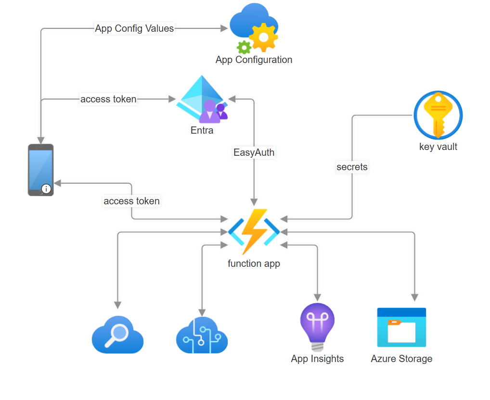
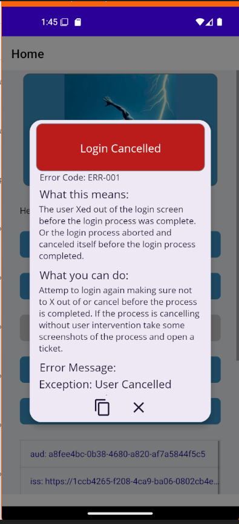
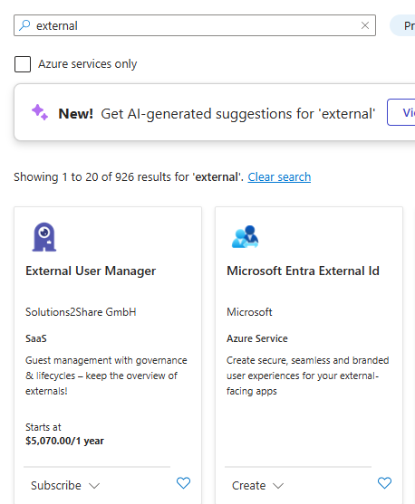
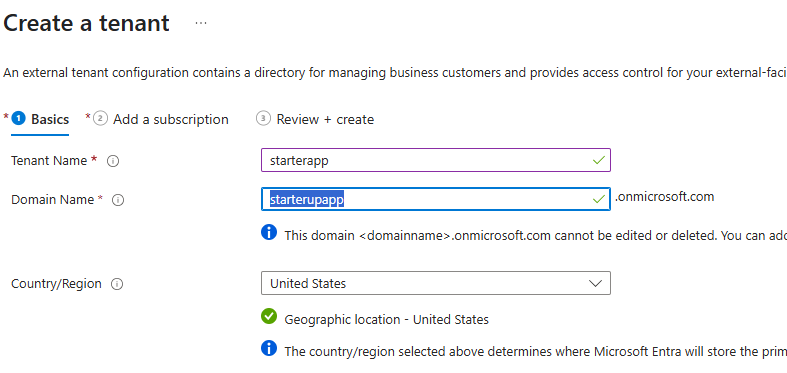
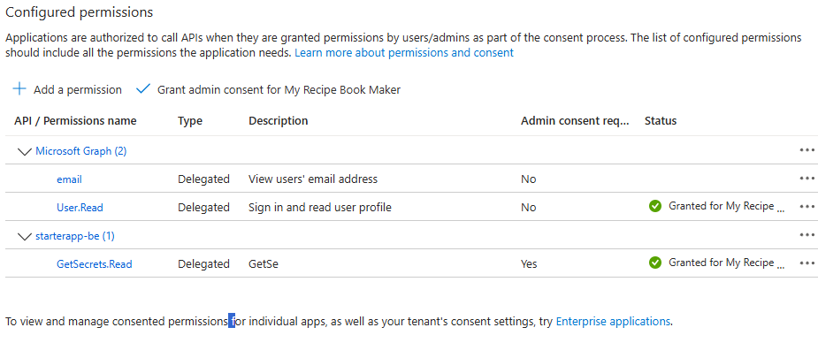
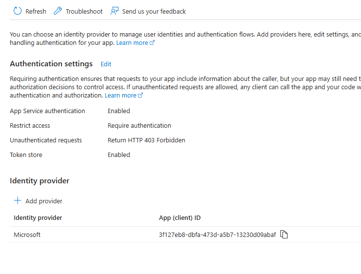

# .NET MAUI Starter App with Authorization

This repository is a starter up that frames up the basic infrastructure and code for a mobile app using Entra External Identification for authentication and authorization for calling Azure functions.  Utilizing App Configuration, KeyVault, and preparing to utilizing AI Services.

I found that getting **Entra Authorization and Authentication working with Azure Functions** was a bit of a challenge.  I wanted to create a starter app that would help me get started with the basics of authentication and authorization.  This is the first step in that process.  The next step will be to add in the AI services and other Azure services.




<!--TOC-->
- [01 - Overview of Starter App - Authentication](#01-overview-of-starter-app-authentication)
  - [A) little color goes a long way](#a-little-color-goes-a-long-way)
  - [B) Standard Error Handling](#b-standard-error-handling)
    - [Third Party Controls](#third-party-controls)
      - [[DevExpress](https://www.devexpress.com/maui/)](#devexpresshttpswww.devexpress.commaui)
      - [[Syncfusion](https://www.syncfusion.com/maui-controls)](#syncfusionhttpswww.syncfusion.commaui-controls)
  - [C) Microsoft Azure AD B2C and Customer (EntraID) Authentication](#c-microsoft-azure-ad-b2c-and-customer-entraid-authentication)
    - [Automating ClientID](#automating-clientid)
  - [Summary](#summary)
- [02 - Starter App - Azure Function Calling with Authentication](#02-starter-app-azure-function-calling-with-authentication)
  - [Configuration Overview](#configuration-overview)
  - [Configuration Steps](#configuration-steps)
    - [1. Create Entra External Configuration Tenant](#1.-create-entra-external-configuration-tenant)
    - [1. Create .NET MAUI App, App Registration in Entra](#1.-create-.net-maui-app-app-registration-in-entra)
    - [3. Create Azure Function App Registration in Entra](#3.-create-azure-function-app-registration-in-entra)
    - [4. Create and Publish Azure Function](#4.-create-and-publish-azure-function)
    - [5. Configure Authorization in Azure Portal for Azure Function](#5.-configure-authorization-in-azure-portal-for-azure-function)
    - [6 Assign RBAC](#6-assign-rbac)
    - [7 The all Important (Turn EasyAuth off and Back On)](#7-the-all-important-turn-easyauth-off-and-back-on)
    - [Learnings](#learnings)
    - [Token Example](#token-example)
  - [Custom Branding](#custom-branding)
<!--/TOC-->

# 01 - Overview of Starter App - Authentication 
This app demonstrates how to use the Microsoft.Identity.Client library to authenticate users and access Microsoft Graph APIs in a .NET MAUI app.  It is based off of the example from [.NET MAUI Authentication](https://github.com/Azure-Samples/ms-identity-ciam-dotnet-tutorial/blob/main/1-Authentication/2-sign-in-maui/README.md)

The intenet of this repo is to create a base MAUI that can be a starting point for creating new applications with the core services already implemented or the framework built out as a good starting point.  

Features
1) Splash Screen and App Icon
1) Standard Error Handling
1) Login with Entra External ID (Azure AD B2C)
1) Custom Branding for Login Experience
1) Azure Function App Registration and Authentication


| Splash | Home Page |
|---------|---------|
| Android |
|| |

|Android | iOS|
|--------|-----|
|| |
| iOS||
| ||


## A) little color goes a long way
Replace the app icon and splash screen with something that is reasonably decent to look at.  I am not sure what it is but the .NET icon and that blue splash screen just does not do it.

My method before going to a pro to get work done is to use designer.microsoft.com and generate an image that you can start with and update later when you are ready to go to market and can spend some time polishing.  But until then theres no need not to have something interesting.

Since this is a starter app I thought of a track runner coming off the blocks.  

Prompt: 
a runner starting out on the running blocks reaching out with one hand attempting to catch a lightning bolt blue background in a minimal 3d digital art style.

And setting the size to a square. Designer came up with what I thought was some pretty cool images.  


MAUI wants an svg file for the icon and splash image.  

**Photpea** is my image editor of choice lately.  It's as simple as opening the file and exporting to svg.  Then adding the svg file to the Resources\AppIcon and Resources\Splash folders in the project.  Double checking that the properties are set to MauiIcon and MauiSplash respectively.

I use powertoys to grab a color from the image randomly picking a color for the background.


		<!-- App Icon -->
		<MauiIcon Include="Resources\AppIcon\appicon.svg" />
		
		<!-- Splash Screen -->
		<MauiSplashScreen Include="Resources\Images\startappicon.svg">
		  <Color>#3b92c4</Color>
		  <BaseSize>128,128</BaseSize>
		</MauiSplashScreen>


## B) Standard Error Handling

I wrote a blog on this topic awhile back.  One of the first components needed in an app is the ability to tell the user something went wrong. I like to have this in place even before I start with authentication in that if authentication doesn't work you need to display an error message.  So it's one fo the first things I put in place.  The details of this can be found at the following link:

https://bradyguy.blog/dotnet-maui-standard-error-popup-pattern/

A quick recap:
In the folder CustomControls I put the class that defines the controls bindable properties.

In the Resources/Styles folder I added a file called ControlTemplates.xaml and added to the resource dictionary in the app.xaml file so that it's available throughout the entire app.

```XAML
    <ControlTemplate x:Key="ErrorPopupStandard" x:DataType="controls:ErrorPopupView">
        <popup:SfPopup
            x:Name="popupLayout"
            AcceptButtonText="OK"
            AppearanceMode="OneButton"
            BindingContext="{Binding Source={RelativeSource TemplatedParent}}"
            FooterHeight="40"
            HeaderHeight="80"
```

And you use the control in your page as follows:

```XAML
  <controls:ErrorPopupView
            Grid.Row="0"
            Grid.Column="0"
            ControlTemplate="{StaticResource ErrorPopupStandard}"
            ErrorCode="{Binding PopupDetails.ErrorCode}"
            ErrorMessage="{Binding PopupDetails.ErrorMessage}"
            ErrorReason="{Binding PopupDetails.ErrorReason}"
            HeightRequest="500"
            ShowErrorPopup="{Binding PopupDetails.IsOpen, Mode=TwoWay}"
            WidthRequest="300" />
```



### Third Party Controls


I use several third party controls that are free up to a certain extent.  You'll need to read the latest at devexpress and syncfusion license information. 
#### [DevExpress](https://www.devexpress.com/maui/)

 I like the theming capablities of devexpress.  The the theme manager can be used through out your app on all controls.  You can pick from several predefined theme colors or use hex color code as the base for the theme.  In the settings component I'll add the capability for the user to choose their own theme color.

 I have also found that I like the collectionview from devexpress over syncfusion and MAUI.  It's incredible easy to enable drag and drop.  And the Items filter capability is one of the most flexible I have seen.

#### [Syncfusion](https://www.syncfusion.com/maui-controls)

Syncfusion is the other provider of controls I use.  For some reason I could not get the devexpress popup control to work in a custom control.  It's most likely something I wasn't doing right but for expedancy I switched over to syncfusion and got the popup working in no time.  

The Rotator navigation control from syncfusion is really cool. 


## C) Microsoft Azure AD B2C and Customer (EntraID) Authentication

Utilizing the code from Microsoft at from 1-Authentication\2-sign-in-maui as an example from the offical example at  [.NET MAUI Authentication](https://github.com/Azure-Samples/ms-identity-ciam-dotnet-tutorial/blob/main/1-Authentication/2-sign-in-maui/README.md), I integrated this into my starter project as the basis for authentication.

Setting up the configuration of authentication in the Azure portal is covered in section 2 below.


### Automating ClientID 

The ClientID is stored in the appsettings.json file.  This id comes from registering your app in Azure AD B2C. It is 'hardcode' in serveral files throughout the project and in some places can't be reference as a constant or variable.  Thus this powershell script does a search and replace of the client id in the project files.

Platforms\Android\[MsalActivity.cs,MainActivity.cs,AndroidManifest.xml]
Are updated with the client id using the value appsettings.json file.

This happens with every build so beaware if something unusal starts to happen to check and make sure the script hasn't mucked with anything by acident.

```
<Target Name="Update MSAL Client ID" BeforeTargets="BeforeBuild">
	<Exec Command="powershell.exe  -NoProfile -NonInteractive -ExecutionPolicy Bypass -File $(ProjectDir)updatemsal.ps1" />
</Target>
```

## Summary
At this point we have a code base that has a splash screen, app icon, error handling, and authentication.  

The next step is to configure authentication and authorization in the Azure portal add code to test the error handler, sign in, sign out, and the ability to call an Azure Function with authentication.  


# 02 - Starter App - Azure Function Calling with Authentication

## Configuration Overview

## Configuration Steps
1) Create Entra External Configuration Tenant
1) Create .NET MAUI App, App Registration in Entra
1) Create Azure Function App Registration in Entra
1) Stub out Azure Function and Publish
1) Configure Authorization in Azure Portal for Azure Function
1) Assign RBAC to Azure Function App Registration
1) The all Important (Turn EasyAuth off and Back On)

    Don't forget that last step

### 1. Create Entra External Configuration Tenant

1. In Azure portal go to all resource and select create at the top
1. Search for 'External' and select Microsoft Entra External Id to create a new instances

    
1. Give your tenant a name and domain name.

### 2. Create .NET MAUI App, App Registration in Entra
  
1. Create a new App Registration in Entra for the .NET MAUI app.
    1) Add platform and check msal...://auth
    1) Add API Permissions
        1) Microsoft Graph - User.Read
        1) Grant admin consent for the API permissions
    1) Configure User flows (Sign up and sign in)
    1) Link Application to User Flow


### 3. Create Azure Function App Registration in Entra
    1) Expose an API
        1) click add a scope
        1) set the scope name to api://<your-app-client-id>/GetSecrets.Read (for this example)
        1) click add a client application
            1) paste in the client id of the .NET MAUI app registration you created in step 2
        1) Token Configuration 
            1) add option claim and ID and Access token
                1) add acct, aud,email, verified_primary_email
                1) you may want other claims in the token to meet your needs
    

### 4. Create and Publish Azure Function
    1) Publish Azure Function in Visual Studio
    1) Publish to Azure Function App
    1) In azure portal 
        1) go to the function app and select the function you just published
        1) select the function and go to the "Authentication" blade
        1) select "Add Identity Provider"
        1) select "Microsoft" and then select the app registration you created in step 3
            1) Under the Basics Tab
                1) select External Configuration
                1) select Provide the details of an existing app registration
                1) Application ID - the app registration id you created in step 3 for the function app
                1) no Client Secret
                1) Issuer URL - this is the tenant url created in step 1 for the external configuration tenant
                    1) go to entra admin center and make sure your directory is set for the external configuration tenant
                    1) select the overview tab
                    1) select endpoints
                    1) copy the authority url usually the first end point
                    1) paste in the Issuer URL field in the azure function app registration
                1) Allow request from specific client applications
                    1) select the app registration you created in step 2 for the .NET MAUI app
                    1) paste in the Application ID in the client application id field of the .NET MAUI app registration
                    Note: this is the clientID in the .NET MAUI app settings.json file
                1) Allow request from specific client applications
                    1) this is the tenant id which is the guid at the end of the authority url in appsettings.json in the .NET MAUI app and you can also find it in the endpoints section of the Entra admin center for the external configuration tenant, and on the overview page of the tenant it is the direcorty (tenant id).
                1) Set Restrict access to 'Require authentication'
                1) Unauthorized request I set to HTTP 403 Forbidden.
        1) click Add
        1) Under the Identity tab for the fucntion app I also enable Managed Identity for future access to other Azure resources.


                    

    Authentication - Microsoft Identity Platform
    External Configuration
    Provide details of an existing app registration
issuer url: same as what you have 


### 5. Configure Authorization in Azure Portal for Azure Function

    1) In Entra under the .NET MAUI app registration you created in step 2
    1) select API Permissions
        1) click add a permission
        1) select APIs my organization uses
            1) search for the Azure Function app registration you created in step 3
            1) select the function app registration and click add permissions
            1) select the scope you created in step 3 for the function app registration
            1) when added be sure you click on Grant admin consent for the API permissions


### 6 Assign RBAC 
    1) Navigate to your key vault in the Azure portal.
    1) In the left-hand menu, select "Access control (IAM)".
    1) Click on "Add role assignment".
    1) In the "Role" dropdown, select "Key Vault Reader".
    1) In the "Assign access to" dropdown, select "Managed Identity".
    1) In the "Select" field, search for and select the managed identity of your Azure Function App.
    1) Click "Review and Assign" to assign the role.

### 7 The all Important (Turn EasyAuth off and Back On)

   1) In the Azure portal, navigate to your Function App.
    1) In the left-hand menu, select "Authentication" under the "Settings" section.
    1) Click the Edit button at the top of the page.
    1) Set to Disabled and click "Save".
    1) Click the Edit button again to re-enable authentication.

    Not exactly sure why this step is needed but it just don't work if you don't do it.  At least as far as I have seen.




### Learnings
1) Token Cache changing scopes need to factory reset emulator or delete app on emulator
### Token Example


## Custom Branding

The following article has the detailed instructions on how to implement your own custom branding for the login experience. 

https://learn.microsoft.com/en-us/entra/fundamentals/reference-company-branding-css-template

From the External ID 


```css
@font-face {
    font-family: 'Great Vibes';
    src: url('https://fonts.gstatic.com/s/greatvibes/v10/RWmMoKWR9v4ksMfaWd_JN9XFiaQo.ttf') format('truetype');
    font-style: normal;
    font-weight: 400;
}

@font-face {
    font-family: 'Caveat';
    src: url('https://fonts.gstatic.com/s/caveat/v28/Wnz6HA03aAXoe4PzKSBs5w.ttf') format('truetype');
    font-style: normal;
    font-weight: 400;
}


/* General body styling */
body {
    font-family: 'Caveat', cursive;
    background-color: #F5DEB3; /* Light brown background (Wheat color) */
    color: #5D3A00; /* Dark brown text */
    margin: 0;
    padding: 0;
  font-size: 24px;
}

/* Background image container */
.ext-background-image {
    background-color: #F5DEB3; /* Light brown background */
}

/* Header styling */
.ext-header {
    font-family: 'Great Vibes', cursive;
    background-color: #D2B48C; /* Tan color for header */
    color: #5D3A00; /* Dark brown text */
    text-align: center;
    padding: 10px;
    font-size: 32px;
    font-weight: bold;
}

/* Header logo styling */
.ext-header-logo {
    max-height: 50px; /* Ensure the logo fits well */
}

/* Sign-in box container */
.ext-sign-in-box {
    background-color: #EED9C4; /* Light brown color */
    color: #5D3A00; /* Dark brown text */
    border: 2px solid #C5A478; /* Slightly darker border */
    border-radius: 10px; /* Rounded corners */
    padding: 20px;
    box-shadow: 0 4px 6px rgba(0, 0, 0, 0.1); /* Subtle shadow for depth */
}

/* Title text inside the sign-in box */
.ext-title {
    font-family: 'Great Vibes', cursive;
    font-size: 36px;
    font-weight: bold;
    color: #5D3A00; /* Dark brown text for contrast */
    text-align: center;
    margin-bottom: 10px;
}

/* Subtitle text inside the sign-in box */
.ext-subtitle {
    font-family: 'Caveat';
    font-size: 18px;
    color: #5D3A00; /* Dark brown text for contrast */
    text-align: center;
    margin-bottom: 20px;
}

/* Primary button styles */
.ext-button.ext-primary {
    background-color: #602c1b; /* Darker light brown for better contrast */
    color: #FFFFFF; /* White text for high contrast */
    border: none;
    padding: 10px 20px;
    font-family: 'Great Vibes', cursive;
    font-size: 18px;
    font-weight: bold;
    border-radius: 5px;
    cursor: pointer;
    transition: background-color 0.3s;
}

.ext-button.ext-primary:hover {
    background-color: #602c1b; /* Even darker brown on hover for feedback */
}

.ext-button.ext-primary:focus,
.ext-button.ext-primary:focus:hover {
    outline: 2px solid #5D3A00; /* Outline on focus */
}

/* Secondary button styles */
.ext-button.ext-secondary {
    background-color: #C5A478; /* Slightly darker than the previous lighter brown */
    color: #5D3A00; /* Dark brown text for contrast */
    font-family: 'Tahoma', cursive;
    border: 1px solid #A97F50; /* Border matches the primary button's color */
    padding: 8px 16px;
    font-size: 16px;
    font-weight: bold;
    border-radius: 5px;
    cursor: pointer;
    transition: background-color 0.3s;
}

.ext-button.ext-secondary:hover {
    background-color: #B29064; /* Slightly darker brown on hover */
}


/* Footer styles */
.ext-footer {
    background-color: #D2B48C; /* Tan color for footer */
    color: #5D3A00;
    text-align: center;
    padding: 10px;
    font-size: 14px;
    font-family: 'Great Vibes', cursive;
}

/* Links in the footer */
.ext-footer-links a {
    color: #8B4513; /* SaddleBrown */
    text-decoration: none;
    font-weight: bold;
    font-family: 'Great Vibes', cursive;
}

.ext-footer-links a:hover {
    text-decoration: underline;
}

.ext-middle {
 display: flex; /* Use flexbox for centering */
    justify-content: center; /* Horizontal centering */
    align-items: center; /* Vertical centering */
    height: 100vh; /* Full viewport height */
    background-color: #F5DEB3; /* Optional: light brown background */
 
}

```